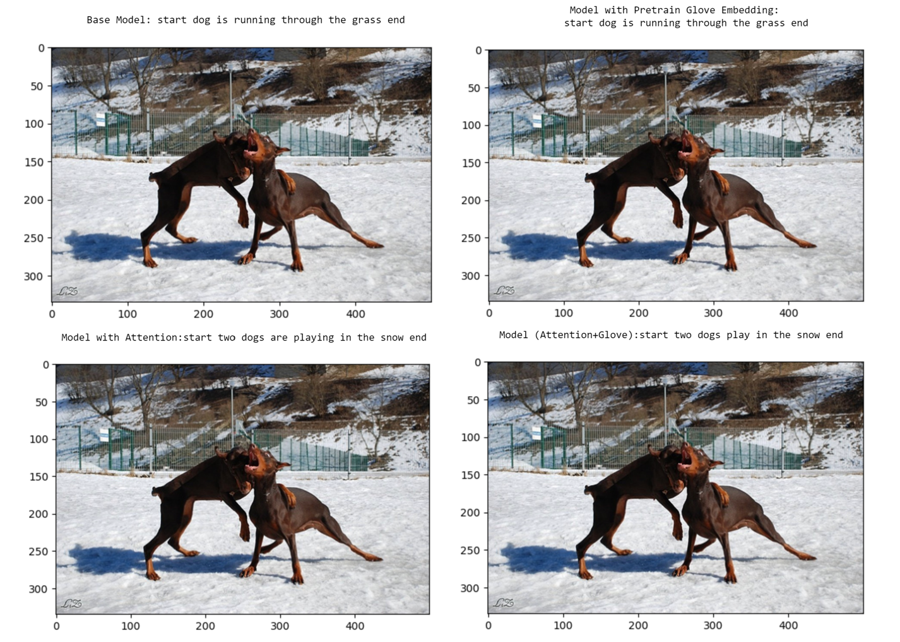

# Advanced Image Captioning with Neural Architectural Enhancements (CNN, LSTM, Transformers)

## Description

This repository presents an advanced Image Captioning model, synergizing the prowess of Convolutional Neural Networks (CNN), Long Short-Term Memory (LSTM) networks, and the modern Transformer architectures. The project's primary goal is to generate accurate and descriptive captions for a diverse set of images. The results were significantly improved through the integration of Transformer components and visual attention mechanisms.

## Datasets

We leveraged two distinguished datasets:

1. **COCO Dataset**: A benchmark dataset facilitating several computer vision tasks. It offers images coupled with annotations and captions, giving a comprehensive set of labels for in-depth understanding.

2. **Flickr8k Dataset**: A collection of 8,000 images from Flickr, each paired with five different descriptive captions.

## Features

- **Pre-trained CNNs with Xception**: Efficient feature extraction from images was achieved using the pre-trained Xception model.

- **LSTM for Sequence Generation**: Leveraging the power of LSTM, sequences corresponding to image descriptions were generated. The inherent capability of LSTMs to capture long-term dependencies became invaluable.

- **Visual Attention Mechanism**: Implemented a visual attention mechanism, enabling the model to focus on specific regions of the image while generating captions, resulting in more relevant and detailed descriptions.

- **GloVe Embeddings**: Incorporated GloVe embeddings to enrich the representation of words in the captions, thereby enhancing the contextual understanding of the model.

- **Transformer Components**: Integrated Transformer components into the model, harnessing their self-attention mechanisms, which further elevated the overall captioning quality.

## Performance Metrics

Our fine-tuned model demonstrated impressive results:
- **BLEU-4 score**: 25
- **ROUGE-L F1 Score**: 48.5

## Contact

For any queries or suggestions, please reach out to me at:[vishalpanda10@gmail.com](vishalpanda10@gmail.com).

